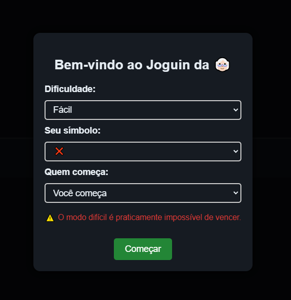
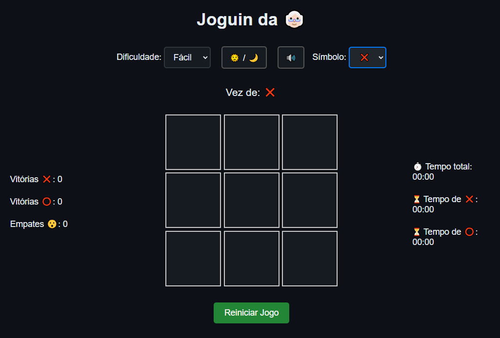
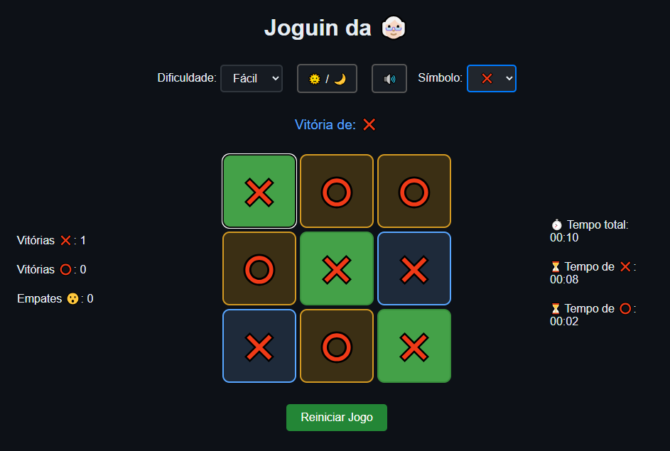
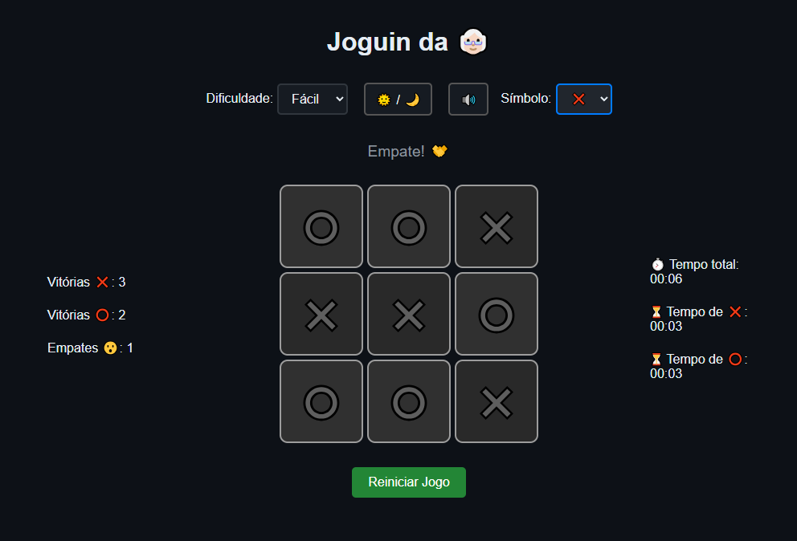

# 

# 🧩 Desafia-se
Jogue contra a IA ou desafie um amigo. Escolha seu símbolo (X ou O), a dificuldade da IA e defina quem começa a jogar!

# 🔍 Sobre

Este é um projeto de **Jogo da Velha** onde o usuário pode jogar contra a IA ou contra outro jogador, escolher o símbolo (X ou O), selecionar a dificuldade da IA (fácil ou difícil), e escolher quem começa (o jogador ou a IA). O jogo tem uma interface interativa com um cronômetro para cada jogador e uma pontuação acumulada.

**Funcionalidades**:
- **Escolha de Símbolo**: O jogador pode escolher ser "X" ou "O".
- **Dificuldade da IA**: A IA pode jogar em dois níveis de dificuldade (fácil e difícil).
- **Contadores de Tempo**: Um cronômetro é exibido para cada jogador durante o jogo.
- **Pontuação**: A pontuação é exibida durante o jogo, contabilizando vitórias, derrotas e empates.
- **Tema Escuro e Claro**: O jogo oferece a opção de alternar entre o tema claro e o tema escuro.

<br>

# 🖼️ Demonstrações Visuais
📌 Tela Inicial – Configurações do Jogo
Nesta tela, o jogador define as preferências iniciais da partida:

- Escolha do símbolo (❌ ou ⭕)
- Seleção do nível de dificuldade da IA (Fácil ou Difícil)
- Definição de quem começa jogando



## 🎮 Tela Principal – Tabuleiro de Jogo
Após iniciar o jogo, essa tela exibe o tabuleiro interativo.
É aqui que o jogo acontece: os jogadores alternam as jogadas e podem acompanhar o placar e os tempos de cada rodada.



## 🏆 Tela de Vitória
Quando um jogador vence, o jogo destaca as células vencedoras com uma animação e exibe o vencedor claramente no topo da tela.



## 🤝 Tela de Empate
Se todas as células forem preenchidas sem um vencedor, a tela exibe um empate de forma destacada, junto ao som correspondente e efeitos visuais.



<br>


# 🚀 Tecnologias

<div align="center" text-align="center">
  <table>
    <tr>
        <th style="text-align: center;">HTML5</th>
        <th style="text-align: center;">CSS3</th>
        <th style="text-align: center;">JavaScript</th>
    </tr>
    <tr align="center">
      <td>
        
      </td>
      <td>
        
      </td>
      <td>
        
      </td>
    </tr>
  </table>
</div>

<br>

# 📦 Instruções para Rodar o Projeto

1. **Clone o repositório**:
   ```bash
   git clone https://github.com/seu-usuario/jogo-da-velha.git

2. **Abra o diretório do projeto**:
   ```bash
   cd jogo-da-velha

3. **Abra o arquivo index.html em seu navegador**:
- Basta abrir o arquivo index.html diretamente no navegador para começar a jogar.

<br>

# 💬 Como Contribuir

Se você deseja contribuir com melhorias ou correções, siga os passos abaixo:

1. Faça um fork do repositório.

2. Crie uma branch para suas modificações:
    ```bash
    git checkout -b minha-branch

3. Faça as modificações e faça o commit:
    ```bash
    git commit -m "Descrição da alteração"

4. Envie para o seu repositório remoto:
    ```bash
    git push origin minha-branch

5. Abra um pull request no repositório original para revisão.

<br>

# 📜 Licença

Este projeto está licenciado sob a Licença MIT - veja o arquivo [LICENSE](./LICENSE) para mais detalhes.

<br>

# 👨‍💻 Time

<table>
    <tr>
        <td align=center>
            <a href="https://github.com/Anderson-Andy-Correa">
                <br>
                <sub>Anderson Corrêa</sub>
            </a>
        </td>
    </tr>
</table>

<br>

---

# 👨‍🎓 Professor / Orientador

<table>
    <tr>
        <td align=center>
            <a href="https://github.com/drosemannbnusc">
                <br>
                <sub>Douglas Rosemann</sub>
            </a>
        </td>
    </tr>
</table>
